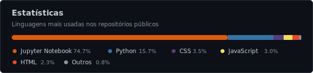

<h2 align="left">Olá, me chamo Enzo Liutkus Going 👋</h2>

  Estudante de Ciência da Computação | Python, dados e Machine Learning aplicado

  
  
  
  
  

---

Sou estudante de Ciência da Computação na Universidade Católica de Santos e estou construindo uma base prática em desenvolvimento, análise de dados e Machine Learning. Gosto de projetos que exigem organização, validação cuidadosa e documentação clara.

Atualmente, meu foco principal é aplicar Python e ciência de dados em problemas reais ou semi-reais, especialmente com dados estruturados, análise exploratória e modelos supervisionados.

### Trabalhando agora

* Machine Learning aplicado a dados estruturados
* Análise exploratória e preparação de datasets
* Validação temporal e comparação com baselines
* Python, pandas, scikit-learn e Jupyter
* Organização de projetos acadêmicos como portfólio técnico

### Tecnologias

### Estatísticas

## Projetos

| Projeto                                                                                        | O que estou praticando                                                                                                                                                                       |
| ---------------------------------------------------------------------------------------------- | -------------------------------------------------------------------------------------------------------------------------------------------------------------------------------------------- |
| [international-conflict-risk-ml](https://github.com/enzo-going/international-conflict-risk-ml) | Machine Learning aplicado à análise preditiva de conflitos internacionais, com unidade country-year, target temporal, validação por baseline e integração progressiva de dados heterogêneos. |
| [tactical-autobattler-python](https://github.com/enzo-going/tactical-autobattler-python)       | Simulador tático em Python com Programação Orientada a Objetos, estratégias automatizadas, torneios, balanceamento, testes e exportação de relatórios em JSON.                               |
| [campsPdfManager-v2](https://github.com/enzo-going/campsPdfManager-v2)                         | Sistema prático para manipulação e digitalização de documentos PDF, com foco em automação, organização de arquivos e uso real em ambiente de trabalho.                                       |
| [analise-cesta-basica-brasil](https://github.com/enzo-going/analise-cesta-basica-brasil)       | Análise exploratória sobre cesta básica, poder de compra e evolução histórica no Brasil, usando Python, dados públicos e visualização.                                                       |
